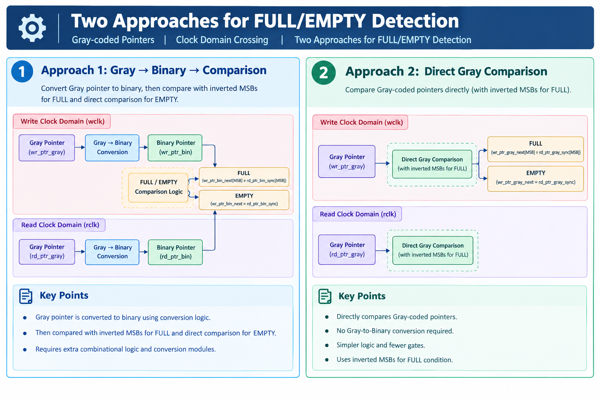

# Asynchronous FIFO using Verilog HDL

## Project Overview

Designed an **8×8 Asynchronous FIFO** using Verilog HDL for data transfer between two independent clock domains.

The design uses **Gray-coded pointers** and **2-flop synchronizers** for Clock Domain Crossing (CDC).

Two approaches for **FULL/EMPTY detection** are implemented and compared.

---

## FIFO Architecture

The FIFO consists of separate Write and Read clock domains connected through FIFO memory.

<p align="center">
  
</p>

### Main Blocks

- Write Clock Domain
- Read Clock Domain
- FIFO Memory
- Write Pointer
- Read Pointer
- Binary-to-Gray Conversion
- 2-Flop Synchronizers
- FULL / EMPTY Detection

---

## Two Approaches for FULL/EMPTY Detection

<p align="center">
  
</p>

### Approach 1: Gray → Binary → Comparison

- Synchronized Gray pointer is converted to Binary.
- Binary pointers are used for FULL/EMPTY comparison.
- Requires additional Gray-to-Binary conversion logic.

### Approach 2: Direct Gray Comparison

- Synchronized Gray pointers are compared directly.
- No Gray-to-Binary conversion is required.
- FULL detection uses the required inverted MSBs.
- Results in simpler comparison logic.

---

## Approach Comparison

<p align="center">
  
</p>

| Feature | Approach 1 | Approach 2 |
|---|---|---|
| Gray-to-Binary conversion | Required | Not required |
| Additional logic | More | Less |
| Design complexity | Higher | Lower |
| Hardware usage | More | Less |
| Efficiency | Lower | Better |

---

## Which Approach is Better?

### Approach 2 – Direct Gray Comparison

Approach 2 is preferred because it:

- Avoids Gray-to-Binary conversion
- Uses simpler logic
- Reduces additional hardware
- Provides a cleaner implementation
- Is more efficient for FULL/EMPTY detection

Both approaches provide the required FIFO functionality, but **Approach 2 offers a simpler implementation**.

---

## Specifications

| Parameter | Value |
|---|---|
| Data Width | 8 bits |
| FIFO Depth | 8 locations |
| Address Width | 3 bits |
| Pointer Width | 4 bits |
| HDL | Verilog |

---

## Key Concepts

- Asynchronous FIFO
- Clock Domain Crossing (CDC)
- Gray Code
- FIFO Pointers
- 2-Flop Synchronizers
- FULL / EMPTY Detection
- RTL Design

---

## Tools Used

- Verilog HDL
- Xilinx Vivado
- Vivado Simulator
- Git
- GitHub

---

## Repository Structure

```text
Asynchronous-FIFO-Verilog/
│
├── README.md
│
├── rtl/
│   ├── async_fifo_binary.v
│   └── async_fifo_gray.v
│
├── testbench/
│   ├── tb_async_fifo_binary.v
│   └── tb_async_fifo_gray.v
│
└── images/
    ├── fifo_architecture.png
    ├── fifo_two_approaches.png
    └── fifo_comparison.png
