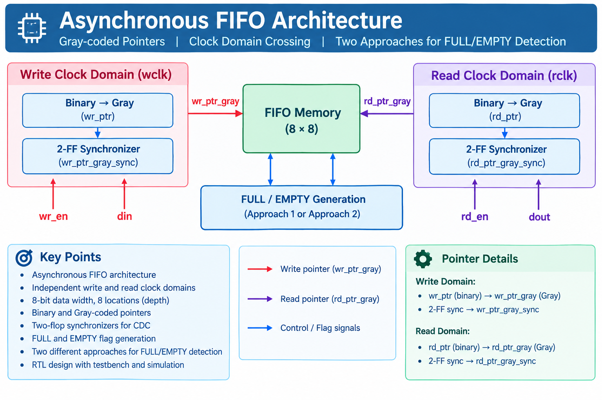
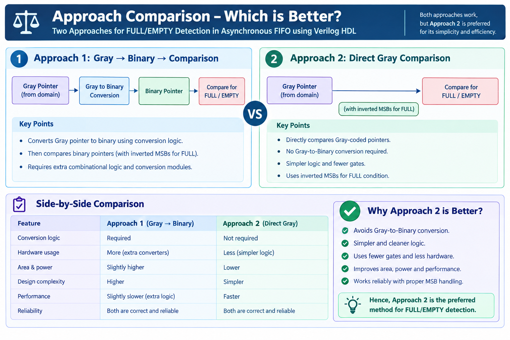
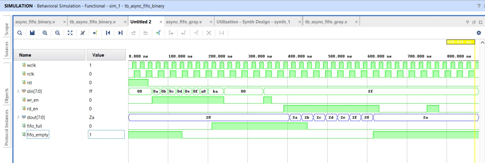
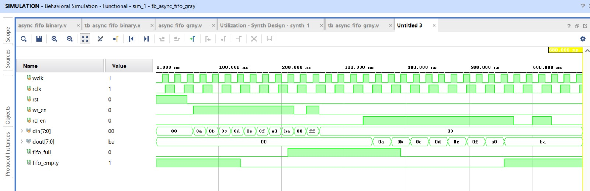
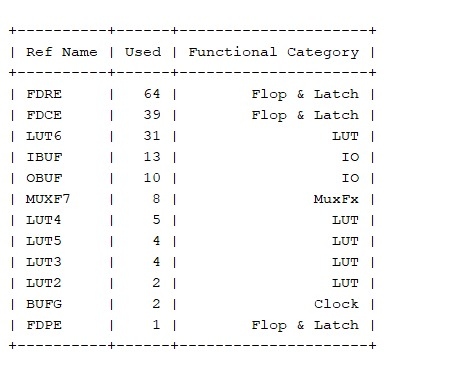
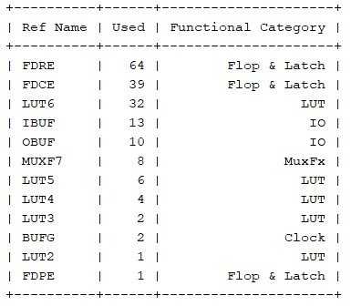

# Asynchronous FIFO using Verilog HDL

## Project Overview

Designed an **8×8 Asynchronous FIFO** using Verilog HDL for data transfer between two independent clock domains.

The design uses **Gray-coded pointers** and **2-flop synchronizers** for Clock Domain Crossing (CDC).

Two approaches for **FULL/EMPTY detection** are implemented and compared.

---

## FIFO Architecture

The FIFO consists of separate Write and Read clock domains connected through FIFO memory.

<p align="center">
  
</p>

### Main Blocks

- Write Clock Domain
- Read Clock Domain
- FIFO Memory
- Write Pointer
- Read Pointer
- Binary-to-Gray Conversion
- 2-Flop Synchronizers
- FULL / EMPTY Detection

---

## Two Approaches for FULL/EMPTY Detection

<p align="center">
  
</p>

### Approach 1: Gray → Binary → Comparison

- Synchronized Gray pointer is converted to Binary.
- Binary pointers are used for FULL/EMPTY comparison.
- Requires additional Gray-to-Binary conversion logic.

### Approach 2: Direct Gray Comparison

- Synchronized Gray pointers are compared directly.
- No Gray-to-Binary conversion is required.
- FULL detection uses the required inverted MSBs.
- Provides simpler FULL/EMPTY detection logic.

---

## Approach Comparison

<p align="center">
  
</p>

| Feature | Approach 1 | Approach 2 |
|---|---|---|
| Gray-to-Binary conversion | Required | Not required |
| FULL/EMPTY comparison | Binary | Direct Gray |
| Design complexity | Higher | Lower |
| Additional conversion logic | Required | Not required |
| Implementation | More complex | Simpler |

---

## Which Approach is Better?

### Approach 2 – Direct Gray Comparison

Approach 2 is preferred for this design because it:

- Avoids Gray-to-Binary conversion
- Simplifies FULL/EMPTY detection
- Reduces logic stages
- Provides a cleaner RTL implementation

Both approaches were implemented and verified successfully.

---

## Specifications

| Parameter | Value |
|---|---|
| Data Width | 8 bits |
| FIFO Depth | 8 locations |
| Address Width | 3 bits |
| Pointer Width | 4 bits |
| HDL | Verilog |

---

## Simulation Results

Both implementations were simulated using **Xilinx Vivado Simulator**.

### Approach 1 – Simulation

<p align="center">
  
</p>

The waveform verifies FIFO write, read, FULL and EMPTY operations.

### Approach 2 – Simulation

<p align="center">
  
</p>

The waveform verifies FIFO write, read, FULL and EMPTY operations.

---

## Synthesis Results

Both approaches were synthesized using **Xilinx Vivado**.

### Approach 1 – Resource Utilization

<p align="center">
  
</p>

### Approach 2 – Resource Utilization

<p align="center">
  
</p>

### Resource Comparison

| Resource | Approach 1 | Approach 2 |
|---|---:|---:|
| FDRE | 64 | 64 |
| FDCE | 39 | 39 |
| LUT6 | 31 | 32 |
| IBUF | 13 | 13 |
| OBUF | 10 | 10 |
| MUXF7 | 8 | 8 |
| LUT5 | 4 | 6 |
| LUT4 | 5 | 4 |
| LUT3 | 4 | 2 |
| LUT2 | 2 | 1 |
| BUFG | 2 | 2 |
| FDPE | 1 | 1 |

The overall resource utilization is **very similar** for both approaches in this small FIFO implementation.

Approach 2 provides its main advantage by eliminating the explicit **Gray-to-Binary conversion** in the FULL/EMPTY detection path.

---

## Verification

The testbenches verify:

- Reset operation
- FIFO write operation
- FIFO FULL condition
- Extra write when FIFO is FULL
- FIFO read operation
- FIFO EMPTY condition
- Extra read when FIFO is EMPTY

Both approaches were verified using independent testbenches.

---

## Key Concepts

- Asynchronous FIFO
- Clock Domain Crossing (CDC)
- Gray Code
- FIFO Pointers
- 2-Flop Synchronizers
- FULL / EMPTY Detection
- RTL Design
- FPGA Synthesis
- Functional Verification

---

## Tools Used

- **Verilog HDL**
- **Xilinx Vivado**
- **Vivado Simulator**

---

## Repository Structure

```text
Asynchronous-FIFO-Verilog/
│
├── README.md
│
├── RTL/
│   ├── async_fifo_binary.v
│   └── async_fifo_gray.v
│
├── Testbench/
│   ├── tb_async_fifo_binary.v
│   └── tb_async_fifo_gray.v
│
└── Images/
    ├── fifo_architecture.png
    ├── fifo_two_approaches.png
    ├── fifo_comparison.png
    ├── approach1_waveform.png
    ├── approach1_utilization.png
    ├── approach2_waveform.png
    └── approach2_utilization.png
